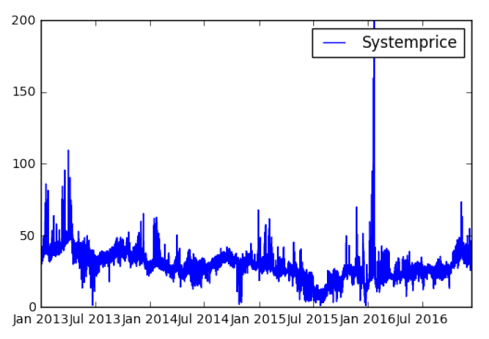
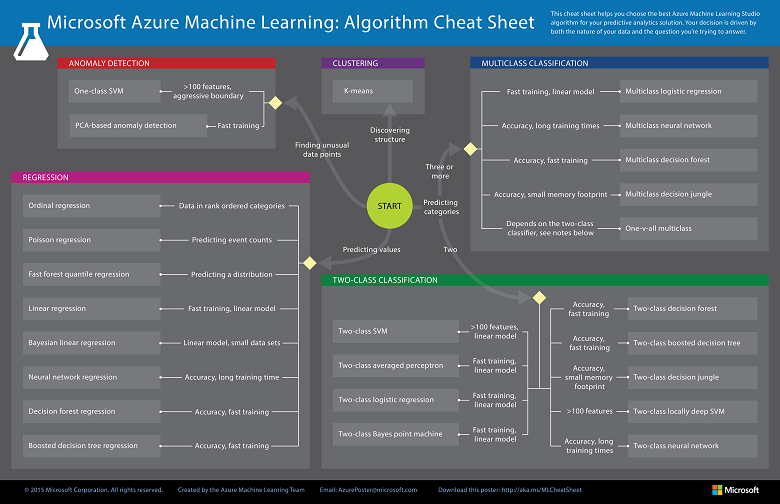

# Electricity Spot Price Forecasting with Powel

### Author: [Olav Tollefsen](https://www.linkedin.com/in/olavtollefsen/), Microsoft Norway

Optimization of production and distribution across seasons and multiple years is crucial to maximize resource value in electrical production companies.

Market prices as well as access to resources are affected by weather conditions and behavior of other market participants. Situations change between seasons, and every year is different.

During a 4-day hackfest, Powel tested out various Azure Machine Learning based approaches for predicting future spot prices and electricity consumption with the goal of improving their solutions used by customers involved in the electricity market.

### Key technologies used

The following technologies was used during the work:
- Azure Blob Storage for storing the raw and processed data files
- Azure Machine Learning to build, test and deploy machine learning models
- Azure Jupyter Notebooks to host Python scripts for data cleaning / pre-processing
- Data Science VM with R-tools

### Hackfest members
 
| Company   | Name                         |
| -------   | ----                         |
| Powel     | Ulf Brännlund                | 
|           | Kai Erik Dahlen              | 
|           | Ståle Toften                 |
| Microsoft | Olav Tollefsen               |
|           | Chew-Yean Yum                | 
|           | Beth Zeranski                | 

## Customer profile ##

[Powel](http://www.powel.com/) spans Europe with a broad and sustainable customer base and a long history
as a trusted supplier of software solutions for cities / municipalities, counties,
the energy industry, as well as the contracting sector. Ca USD 50M revenue and
400 employees. The company has offices across Norway as well as in Sweden,
Denmark, Switzerland, Chile, Turkey and Poland.
 
## Problem statement ##

Forecasting and planning have typically been done using very complex analysis based on fundamental models, which are slow and hard to administrate.

The Nordic electricity market are divided into several bidding areas. The available transmission capacity may vary and congest the flow of power between the bidding areas, and thereby different area prices are established.

To be able to complete the work within a week we focused on predicting electricity prices for one area only.

*Prices and distribution flow of electricity for the areas in the Nordic market*

 

## Solution and steps ##

The solution is built using the Microsoft Cortana Intelligence Suite. Raw data is imported into cloud using the Azure Data Factory. In the exploration phase, the data scientists will work on the data and machine learning models using their favorite tools using various Azure ML services or tools installed in a VM hosted in Azure. This ensures maximum flexibility, easy access and team collaboration.

When successful machine learning models have been created, they will be deployed as web services using the Azure ML service, where they can easily be used by the applications delivered as a service to the customers.

*Machine learning architecture*

 

### Machine learning process

To be successful with data analysis and working with machine learning models, we needed to understand the whole process from the raw data until we had a reasonably good model that was ready to be used by the application. The process we used is illustrated here:

*Machine learning process*

 

## Technical delivery ##

### Data sources

The data sources used as input to the machine learning model experiments include data like:
- Weather data (temperature, rainfall, wind etc.)
- Calendar information (public holidays, weekdays etc.)
- Data on water reservoirs (how many MWh are stored)
- Historical spot prices

The raw data sources are typically available as comma separated flat files, which will be downloaded from the source and imported into the Azure Blob Storage. To orchestrate and automate the process for a production scenario, Azure Data Factory will be used.

### Data import / pre-process

To prepare and pre-process the data we used a combination of Azure Machine Learning Studio and Jupyter Notebooks (also provided as a service by Azure). The key to be able to iterate fast over different data sources and be able to produce the relevant data sets for machine learning is to script and automate every step of the process to eliminate time consuming and error-prone manual steps.

Using Python and Pandas DataFrame provides a lot of nice functionality for working with various kinds of input files. Python (and R) scripts can also easily be incorporated into the Azure Machine Learning Studio Experiments as a part of the workflow.

*Using R Script in Azure ML Studio*


### Data quality check

A key part of the data preparation process is also to visualize the various data sets in order to be able to spot issues with the data quality / consistency.

Creating charts from the data can easily be done from Python code. Running it using the Azure ML Jupyter Notebook service makes the experience very interactive and collaboration between the team members is very easy, since everyone can share the same workspace. The Azure ML Jupyter Notebook service supports notebooks in the popular languages used by data scientists like Python and R.

*Azure ML Jupyter Notebook Service*


*Python code to visualize data*

```python
%matplotlib inline
plt.plot(systemprice['SYS'], label='Systemprice')
plt.legend()
```

*Electricity spot prices visualized running in the Azure ML Jupyter Notebook service*



### Machine learning

Using Azure ML Studio, we imported data from Azure Blob Storage and could develop and test out different machine learning algorithms to learn more about the relationship between the various input features and how well we could predict the electricity spot price.

*Testing machine learning models in Azure ML*


We also created code in Python and R to run different machine learning libraries as a complement to using Azure ML Studio. This shows an important flexibility as a data science will be able to use their tools of choice, all hosted in the Azure cloud.

*Random Forest Regression in Python*
```python
# Use 2016 as test data, the rest is training data
traindata=merged[merged.index < datetime(2016,1,1)]
testdata=merged[merged.index >= datetime(2016,1,1)]

target=traindata[TargetColumn]
results=testdata[TargetColumn]

# Select model
model=RandomForestRegressor(n_estimators=10, min_samples_leaf=2)
# Train model
model.fit(traindata, target)
# Make predictions
predicted=model.predict(testdata)
...
# Most important features
Feature                 Importance
TemperatureHelsinki     0.503887
dayofyear               0.239997

```

### Evaluating machine learning algorithms

During the explorative phase it is important to test differnt kinds of machine learning algorithms to see how they perform on the datasets. Azure Machine Learning Studio has a large library of algorithms from the regression, classification, clustering, and anomaly detection families. Each is designed to address a different type of machine learning problem. We used the [Microsoft Azure Machine Learning Algorithm Cheat Sheet](https://docs.microsoft.com/en-us/azure/machine-learning/machine-learning-algorithm-cheat-sheet) to identify the approperiate algorithms for the predictive analytics model. Then we ran several tests to see how they performed on our data.

We had most success with some of the Decision Forest algorithms, but we did not reach the level of accuracy required for a production scenario during the few first days as we focused more on the overall process. Fine-tuning the performance of the models requires a bit more work.

*Microsoft Azure Machine Learning Algorithm Cheat Sheet*



*Predicting electricity consumption*


### Using the machine learning models

During the initial phase of the work, we did not get time to focus on using the trained machine learning models. That is however a straight forward process. Azure ML Studio makes it easy to publish a trained model as a REST web service, which then can be called from the application used by Powel's customers.
 
## Conclusion ##

During the 4 days of working, the team was able to import data from various sources, prepare and clean the data and run numerous iterations with different machine learning algorithms on different sets of the input data. A lot of different tools and approaches to solving the business challenges was tested out. Being able to predict future spot prices for electricity is indeed a difficult task and a lot of work remains to be able to get to an acceptable level of accuracy. It turned out to be easier to predict future electricity consumption, where temperature forecast is one important factor. 

Team collaboration was working seamlessly since all the data, machine learning experiments and Jupyter Notebooks were stored in the Azure cloud. Each team member was able to work with their tools of choice, since the Azure platform is making a big effort to support many different technologies, including the open source ecosystem. Azure also offers all the services required to build these kinds of solutions with no waiting time for getting access to resources when they are needed. This ensures a fast and effective process with a minimum of wasted time.

To summarize:
- The Microsoft Azure platform accommodates all required tools for the entire machine learning process.
- Team collaboration is easier and faster when everyone is working against resources in the cloud.
- Azure Machine Learning provides easy and fast access to tools and resources, which does not require complex infrastructure to getting started.
- Predicting electricity spot prices is difficult, but Azure makes the iterations over various experiments faster.
- Azure is a complete platform, which provides all the functionality needed for a complete solution.


### Documentation links

[Azure Machine Learning Documentation](https://docs.microsoft.com/en-us/azure/machine-learning/)

[Introduction to Azure ML R notebooks](https://gallery.cortanaintelligence.com/Notebook/Introduction-to-Azure-ML-R-notebooks-3)
